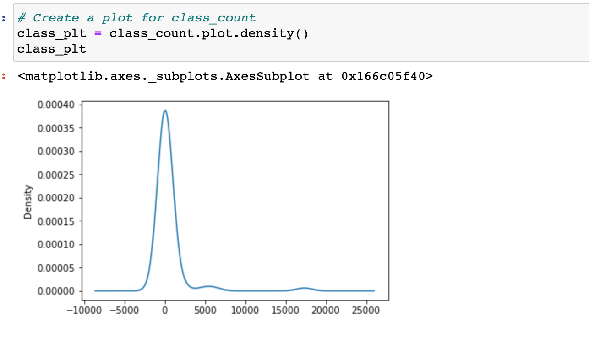
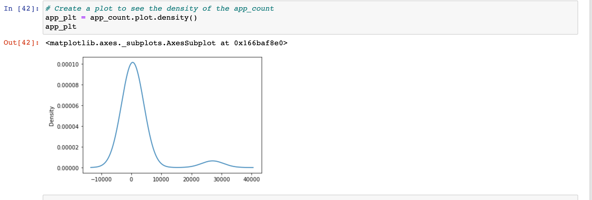
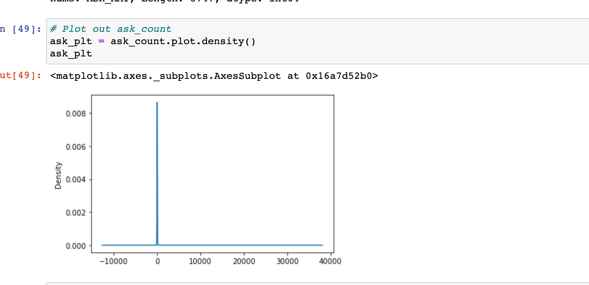

# Neural_Network_Charity_Analysis

# Overview 
Extracted, transformed, and loaded charity_data.csv onto the Jupyter Notebook environment. The data was then trained and tested to create a prediction using neural networks to predict which charities are successful or not. The accuracy was measured to see how succesful the prediction was, while using Pandas, Python, Jupyter Notebook, Scikit-learn, along with tensorflow
# Summary
The target variable for the model was the 'IS_SUCCESSFUL' column. The features were 'APPLICATION_TYPE', 'CLASSIFICATION', 'USE_CASE', 'ORGANIZATION', 'STATUS', 'INCOME_AMT', 'SPECIAL_CONSIDERATIONS', and 'ASK_AMT'. The variables that were removed were 'EIN' and 'NAME' because these values had too many unique values and were not important to the analysis.
# CLASSIFICATION

# APPLICATION_TYPE

# ASK_AMT

## CLASSIFICATION
CLASSIFICATION graph displays much more significant spike in unique values between 0 to 2500. This means that those values can really congest an encoded dataset which means that the columns should be grouped into one column.
## APPLICATION_TYPE
Looking at the APPLICATION_TYPE graph, there is a higher density of values with the unique count from 0 to 10000. The graph can help visualize which values need to be joined to make the a less congested encoded dataframe.
## ASK_AMT
The ASK_AMT graph shows that most of the unique values fall under 10 per column and that there is a skewed data at over 25000 unique values in one column. This data set was organized using bins to help separate the different unique columns.
# Conclusion
Used three different types of models to compare accuracy. Logistic Regression Model Accuracy: 0.716 SVM Model Accuracy: 0.703 Random Forest Predictive Accuracy: 0.717

The trained scaled model for the neural network came out with an accuracy of 0.7386 and a loss of 0.5400. While the test scaled model gave an accuracy of 0.7194 with a loss of 0.5678.

The deep learning model with 2 hidden layers for the trained scaled model gave an accuracy of 0.7477 and a loss of 0.5229 The test scaled model gave an accuracy of 0.7206 and a loss of 0.5974.

The deep learning model with 4 hidden layers for the trained scaled model gave an accuracy of 0.7490 and a loss of 0.5193 The test scaled model gave an accuracy of 0.7188 and a loss of 0.6378.

Looking at all the different models, the deep learning model has a better accuracy score compared to the other models. But comparing between the whether 2 hidden layers or 4 hidden layers are better, the accuracy is better when there are only 2 hidden layers. It seems like the optimal amount of hidden layers is 2. Also having less units plays a role in the accuracy. A reason for this might be that the model is overfitting the data. But out of all the models the best choice is the deep learning neural net model.
